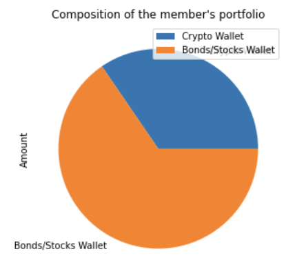

# API Analaysis
The following analysis was conducted on jupyter notebook using python.

**Analysis Objective**
### Part 1
The objective behind the following analysis is to create a financial analysis that consists a financial planner for emergencies, where members could verify their current savings. In order to determine if they have enough for an emergency. 
### Part 2
The logic behind this second step of the analysis was to analyze a 30 year plan vs. a 10 year investment plan in order to see if the member could reach retirement within the time frame. The prediction was done using Monte Carlo simulation. 

# Part 1
**Financial Planner For Emergencies**
- Using my API keys, I obtained the price for Bitcoin and Ethereum, using JSON to naviagte the response objective to acess their current price. With the value of the cryptocurrencies I then calculated the value in USD and their whole value within the portfolio.
- Using my API keys, I checked the values for stocks and bonds, SPY and AGG. And created a dataframe of their closing price. Once done that, I then verified the value in USD of the stocks and bonds portfolios, and then eventually combining them both. 

**Evaluating The Emergency Fund**

The graph below shows the composition of the members'portfolio. 

After having the total value of the member's portfolio I then calculated if they have enough to create an emergency fund as part of the the member's financial plan. I set that the emergencf fund should be equal three times members income, 36000 (12000 x 3). After doing it so, I created three conditional statements. The first, if the member's total portfolio value is bigger thatn its emergency fund, it would say that the member has enough money in this fund. Second, if the member's total portfolio value is smaller thatn its emergency fund, it would say how much it is missing in order to member achieve such financil goal. And last, if portfolio value is equal to emergency fund value, then it would say that the member has reached an important financial goal.

# Part 2
**Financial Plan for Retirement with Monte Carlo Simulation**
- Using my Alpaca keys, I traced back 3 years of historical closing prices for a portfolio that has 60% stocks (SPY) and 40% bonds (AGG). I then ran a Monte Carlo Simulation of 500 samples and 30 years for the portfolio. Based on the current balance of the member's portfolio of $60,688.70. There is a 95% chance that the current investment of Stocks/Bonds worth its current balance in a 60/40 distribution for the next 30 years would result in a value range of $136,012.27 - $2,232,186.72.
- Using my Alpaca keys, I then analyzed the option of investing for a shorter period of time, 10 years instead of 30 years. But investing 80% stocks and 20% bonds. I ran the Monte Carlo simulaiton of 500 samples. Based on the current balance of the member's portfolio of $60,688.70. There is a 95% chance that the current investvent of  Stock/Bonds worth $60,688.70 in a 80/20 distribution for the next 10 years would result in a value range of $53,009.78 and $425,093.08.

# Conclusion
A portoflio heavily weighted in stocks (80%) would not guarantee member's retirement. At the end of the day, in order to reach investment the best thing to do is let it grow with time and not heavily invest on the asset that is more volatile.
